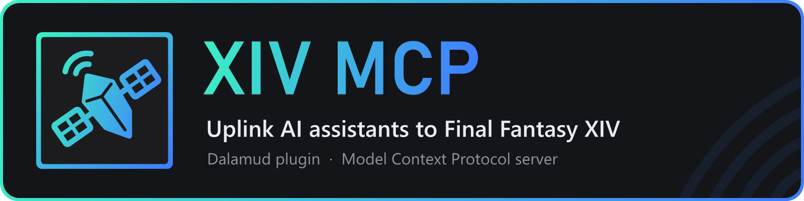

<p align="center"><a href="https://individualgather.github.io/xiv-mcp/"></a></p>

# XIV MCP

A [Dalamud](https://github.com/goatcorp/Dalamud) plugin for Final Fantasy XIV that runs a local **Model Context Protocol (MCP) server** inside the game client. AI assistants such as ChatGPT (Codex), Claude or a model in LM Studio can read your character, inventory, retainers and the game around you, and, when you allow it, act in the game: walk and travel, move items, crystals and gil, trade with other players, send ventures and submersibles, buy and sell, craft, gather, run dungeons, play Triple Triad and the Cactpot, do the Fashion Report, find and catch fish, and run long tasks as background jobs.

- **Local only:** MCP Streamable HTTP at `http://localhost:37521/mcp`, with an access token
- **You decide:** reading is allowed by default; acting, editing and going online are denied until you allow them, per module and per tool, in `/xivmcp`

## Quick start

1. In the game, type `/xlsettings` and open the **Experimental** tab.
2. Under **Custom Plugin Repositories**, paste this URL, tick **Enabled** and click **Save and Close**:

   ```
   https://raw.githubusercontent.com/IndividualGather/xiv-mcp/master/repo.json
   ```

3. Type `/xlplugins`, search for **XIV MCP** in the list and click **Install**.
4. Type `/xivmcp` and open the **Connect** tab to set up your AI app with one click.

Dalamud keeps XIV MCP up to date from then on.

## Documentation

**[individualgather.github.io/xiv-mcp](https://individualgather.github.io/xiv-mcp/)** (sources in [`docs-site/content/docs`](docs-site/content/docs)).

| For | Start here |
|---|---|
| Players | [What is XIV MCP?](https://individualgather.github.io/xiv-mcp/docs/user/), [Installing](https://individualgather.github.io/xiv-mcp/docs/user/install/), [Connecting your AI app](https://individualgather.github.io/xiv-mcp/docs/user/connect/), [Modules and permissions](https://individualgather.github.io/xiv-mcp/docs/user/permissions/modules/), [Tools reference](https://individualgather.github.io/xiv-mcp/docs/user/tools/), [Troubleshooting](https://individualgather.github.io/xiv-mcp/docs/user/troubleshooting/) |
| Plugin developers | [Quick start](https://individualgather.github.io/xiv-mcp/docs/developer/plugin-api/), [Hello MCP](https://individualgather.github.io/xiv-mcp/docs/developer/plugin-api/hello-mcp/), [Client reference](https://individualgather.github.io/xiv-mcp/docs/developer/plugin-api/reference/) |
| Contributors | [Contributing](https://individualgather.github.io/xiv-mcp/docs/developer/contributing/), [Building](https://individualgather.github.io/xiv-mcp/docs/developer/contributing/building/), [Testing](https://individualgather.github.io/xiv-mcp/docs/developer/contributing/testing/), [Architecture](https://individualgather.github.io/xiv-mcp/docs/developer/contributing/architecture/) |

## Building from source

You need the .NET 10 SDK, and XIVLauncher with Dalamud.

```sh
git clone https://github.com/IndividualGather/xiv-mcp.git
cd xiv-mcp
dotnet build XivMcp.slnx
```

Then add the full path to `XivMcp/bin/Debug/XivMcp.dll` under `/xlsettings` → **Experimental** → **Dev Plugin Locations** and enable it in `/xlplugins` → **Dev Tools**.

Tests: `dotnet test --project XivMcp.Tests/XivMcp.Tests.csproj`. Docs site: `cd docs-site && npm install && npm run dev`.

## For plugin developers

Copy [`examples/XivMcpClient.cs`](examples/XivMcpClient.cs) into your plugin to offer tools, ask the player for approvals and start jobs over Dalamud IPC, with no reference to XIV MCP. [`examples/HelloMcp`](examples/HelloMcp) is a complete example plugin.

## Notes

Automating game actions is against the FFXIV terms of service. XIV MCP sends the same requests as manual input, but use it at your own risk, and do not share data about other players.

## License

MIT
